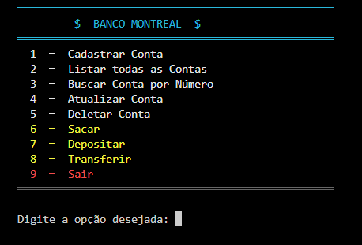
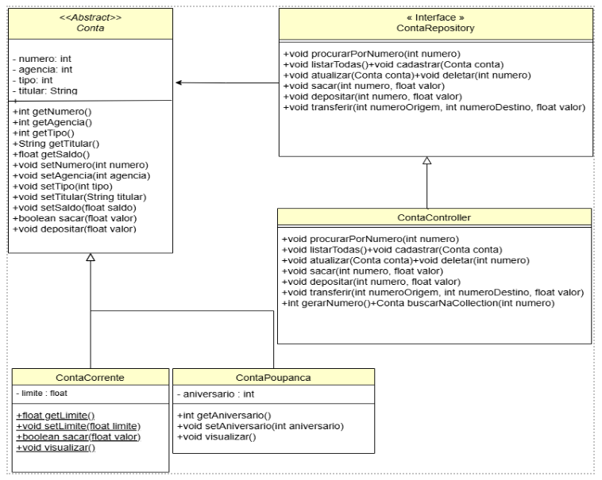

Um projeto em C# que simula um sistema bancário simples com contas correntes e contas poupança. O objetivo é trabalhar com orientação a objetos, validação de dados e operações bancárias básicas.

## Estrutura do repositório

- `ProjetoMontreal.sln` - solução para abrir o projeto no Visual Studio Community 2022.
- `src/ProjetoContaBancaria/` - código-fonte e arquivo `.csproj` da aplicação.
- `docs/images/` - imagens usadas na documentação.
- `README.md` - orientações de uso do projeto.

## Requisitos

- .NET SDK 8.0 ou superior.
- Visual Studio Code com a extensão C# Dev Kit, caso utilize o VS Code.
- Visual Studio Community 2022 versão 17.8 ou superior, caso utilize o Visual Studio.

## Como executar pelo VS Code

Abra o terminal na raiz do repositório e execute:

```powershell
dotnet run --project .\src\ProjetoContaBancaria\Projeto_ContaBancaria.csproj
```

Também é possível entrar na pasta do projeto e executar normalmente:

```powershell
cd .\src\ProjetoContaBancaria
dotnet run
```

## Como executar pelo Visual Studio Community 2022

1. Abra o Visual Studio Community 2022.
2. Selecione **Abrir um projeto ou uma solução**.
3. Escolha o arquivo `ProjetoMontreal.sln`, localizado na raiz do repositório.
4. Aguarde a restauração do projeto.
5. Pressione `F5` para executar com depuração ou `Ctrl + F5` para executar sem depuração.

## Como compilar o projeto

Na raiz do repositório, execute:

```powershell
dotnet build .\ProjetoMontreal.sln
```

## Print do Projeto



## UML do Projeto



## Documentação do código

O código principal está em `src/ProjetoContaBancaria` e está organizado nas seguintes classes:

- `Conta` - classe base para contas bancárias.
- `ContaCorrente` - conta corrente com limite.
- `ContaPoupanca` - conta poupança com data de aniversário.
- `ContaController` - controla armazenamento e operações entre contas.
- `Menu` - interface de console para o usuário.
- `Cores` - classe para definição das cores e estilização do projeto.


